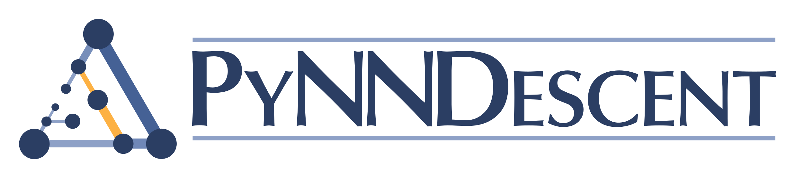

.. image:: https://travis-ci.com/lmcinnes/pynndescent.svg
    :target: https://travis-ci.com/lmcinnes/pynndescent
    :alt: Travis Build Status
.. image:: https://ci.appveyor.com/api/projects/status/github/lmcinnes/pynndescent?branch=master&svg=true
    :target: https://ci.appveyor.com/project/lmcinnes/pynndescent
    :alt: AppVeyor Build Status
.. image:: https://img.shields.io/lgtm/alerts/g/lmcinnes/pynndescent.svg
    :target: https://lgtm.com/projects/g/lmcinnes/pynndescent/alerts
    :alt: LGTM Alerts
.. image:: https://img.shields.io/lgtm/grade/python/g/lmcinnes/pynndescent.svg
    :target: https://lgtm.com/projects/g/lmcinnes/pynndescent/context:python
    :alt: LGTM Grade
.. image:: https://readthedocs.org/projects/pynndescent/badge/?version=latest
    :target: https://pynndescent.readthedocs.io/en/latest/?badge=latest
    :alt: Documentation Status

===========
PyNNDescent
===========

PyNNDescent is a Python nearest neighbor descent for approximate nearest neighbors.
It provides a python implementation of Nearest Neighbor
Descent for k-neighbor-graph construction and approximate nearest neighbor
search, as per the paper:

Dong, Wei, Charikar Moses, and Kai Li.
*"Efficient k-nearest neighbor graph construction for generic similarity
measures."*
Proceedings of the 20th international conference on World wide web. ACM, 2011.

This library supplements that approach with the use of random projection trees for
initialisation. This can be particularly useful for the metrics that are
amenable to such approaches (euclidean, minkowski, angular, cosine, etc.). Graph
diversification is also performed, pruning the longest edges of any triangles in the
graph.

Currently this library targets relatively high accuracy 
(80%-100% accuracy rate) approximate nearest neighbor searches.

--------------------
Why use PyNNDescent?
--------------------

PyNNDescent provides fast approximate nearest neighbor queries. The
`ann-benchmarks <https://github.com/erikbern/ann-benchmarks>`_ system puts it
solidly in the mix of top performing ANN libraries:

**SIFT-128 Euclidean**

.. image:: https://pynndescent.readthedocs.io/en/latest/_images/sift.png
    :alt: ANN benchmark performance for SIFT 128 dataset

**NYTimes-256 Angular**

.. image:: https://pynndescent.readthedocs.io/en/latest/_images/nytimes.png
    :alt: ANN benchmark performance for NYTimes 256 dataset

While PyNNDescent is among fastest ANN library, it is also both easy to install (pip
and conda installable) with no platform or compilation issues, and is very flexible,
supporting a wide variety of distance metrics by default:

**Minkowski style metrics**

- euclidean
- manhattan
- chebyshev
- minkowski

**Miscellaneous spatial metrics**

- canberra
- braycurtis
- haversine

**Normalized spatial metrics**

- mahalanobis
- wminkowski
- seuclidean

**Angular and correlation metrics**

- cosine
- dot
- correlation
- spearmanr
- tsss
- true_angular

**Probability metrics**

- hellinger
- wasserstein

**Metrics for binary data**

- hamming
- jaccard
- dice
- russelrao
- kulsinski
- rogerstanimoto
- sokalmichener
- sokalsneath
- yule

and also custom user defined distance metrics while still retaining performance.

PyNNDescent also integrates well with Scikit-learn, including providing support
for the KNeighborTransformer as a drop in replacement for algorithms
that make use of nearest neighbor computations.

----------------------
How to use PyNNDescent
----------------------

PyNNDescent aims to have a very simple interface. It is similar to (but more
limited than) KDTrees and BallTrees in ``sklearn``. In practice there are
only two operations -- index construction, and querying an index for nearest
neighbors.

To build a new search index on some training data ``data`` you can do something
like

.. code:: python

    from pynndescent import NNDescent
    index = NNDescent(data)

You can then use the index for searching (and can pickle it to disk if you
wish). To search a pynndescent index for the 15 nearest neighbors of a test data
set ``query_data`` you can do something like

.. code:: python

    index.query(query_data, k=15)

and that is pretty much all there is to it. You can find more details in the
`documentation <https://pynndescent.readthedocs.org>`_.

----------
Installing
----------

PyNNDescent is designed to be easy to install being a pure python module with
relatively light requirements:

* numpy
* scipy
* scikit-learn >= 0.22
* numba >= 0.51

all of which should be pip or conda installable. The easiest way to install should be
via conda:

.. code:: bash

    conda install -c conda-forge pynndescent

or via pip:

.. code:: bash

    pip install pynndescent

To manually install this package:

.. code:: bash

    wget https://github.com/lmcinnes/pynndescent/archive/master.zip
    unzip master.zip
    rm master.zip
    cd pynndescent-master
    python setup.py install

----------------
Help and Support
----------------

This project is still young. The documentation is still growing. In the meantime please
`open an issue <https://github.com/lmcinnes/pynndescent/issues/new>`_
and I will try to provide any help and guidance that I can. Please also check
the docstrings on the code, which provide some descriptions of the parameters.

-------
License
-------

The pynndescent package is 2-clause BSD licensed. Enjoy.

------------
Contributing
------------

Contributions are more than welcome! There are lots of opportunities
for potential projects, so please get in touch if you would like to
help out. Everything from code to notebooks to
examples and documentation are all *equally valuable* so please don't feel
you can't contribute. To contribute please `fork the project <https://github.com/lmcinnes/pynndescent/issues#fork-destination-box>`_ make your changes and
submit a pull request. We will do our best to work through any issues with
you and get your code merged into the main branch.

